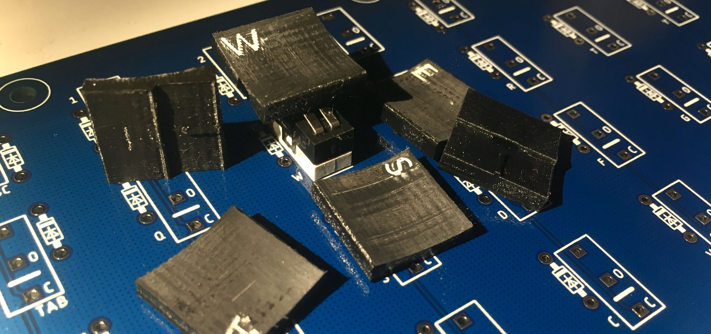

# Keycaps

Due to using non-standard (for keyboards) microswitches, off the shelf MX keycaps have no way of fitting on the board.

Luckily, the lever used on the switches makes a perfect attachment point to slide on 3D printed keycaps.

Stabilisers for the spacebar are made of switches with their button removed, so there is only one switch (in the center) which makes electrical contact.

Adaptors to MX are planned, but as the microswitch levers hinge instead of slide, it may not be possible.

The keycaps on the completed build have white paint put into the letters for better visibility.
Not all keycaps are included, as they are being reworked.

